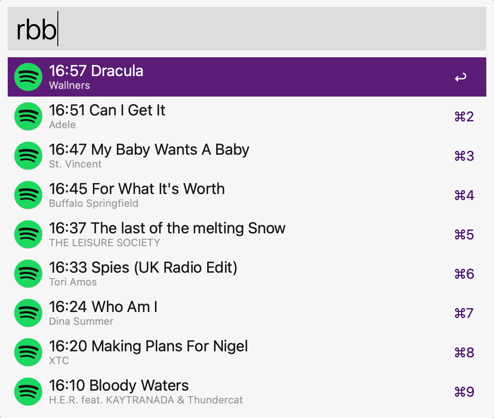

# Alfred radioeins Spotify

Alfred workflow to show the most recent tracks played on RBB radioeins and open them in Spotify.

## Requirements

- Alfred Powerpack
- Spotify Premium

## Setup

First create a virtual Python environment and install the required sources.

```bash
$ python3 -m venv src/envs/radioeins
$ src/envs/radioeins/bin/pip install -r requirements.txt
```

Then link this folder (contains the _info.plist_) to your the alfred preferences folder:

```bash
$ ln -s . ~/Library/Application\ Support/Alfred/Alfred.alfredpreferences/workflows/
```

This results in a folder _alfred_radioeins_ in the _workflows/_ folder mentioned above.

## Usage

Type _rbb_ into the Alfred command line and you should see the list of the tracks played in the last hour. Search Spotify by selecting the actual track and press enter.


